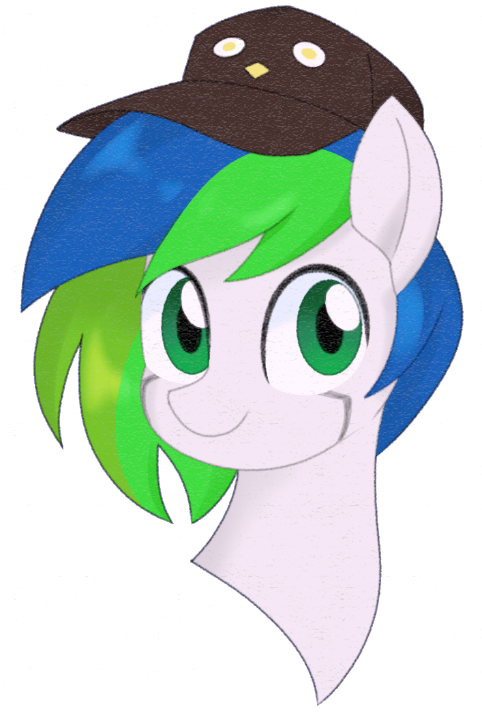

 <h1>Thimble Bot - Telegram</h1>

[](https://bot.thimble.cx)

A Telegram port of [Thimble Bot](https://github.com/jozsefsallai/thimble-bot). It is very early in development, so it's very beta/unstable.

## Requirements
  * Go (v1.13 or older is recommended)

## Getting Started

**1. Clone the repository**

```
git clone git@github.com:jozsefsallai/thimble-bot-telegram.git
cd thimble-bot-telegram
```

**2. Install the dependencies**

```
go mod tidy
```

**3. Create your config file**

```
cp config.example.json config.json
nano config.json
```

Provide the token you got from The Botfather.

**4. Start the thing!**

```
go run main.go
```

## Production

In production environments, it is recommended that you build a binary of your Thimble Bot Telegram instance and run it as a systemd unit.

## License

All rights reserved and MIT. (for now)

*(avatar by [Ch-Chau](https://www.deviantart.com/ch-chau/))*
